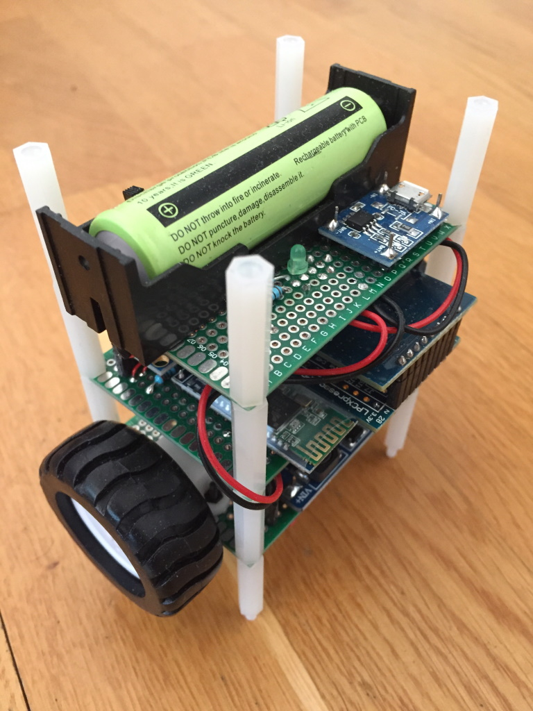

# EmbExp-BalRob - embedded experiment balancing robot
This an embedded experiment that is meant to be a physical demonstrator for execution time analysis.

The build infrastructure is shared with [`EmbExp-ProgPlatform`](https://github.com/kth-step/EmbExp-ProgPlatform) in order to integrate with analysis in [`HolBA`](https://github.com/kth-step/HolBA).

This repository contains the source code for a simple LPC11C24 based balancing robot as well as a companion tool `RemoteControl`.
The mechanical setup is inspired by the following instructions:
[Arduino Self-Balancing Robot](https://www.instructables.com/id/Arduino-Self-Balancing-Robot-1/).

## Getting started
Setup a [`HolBA`](https://github.com/kth-step/HolBA) environment with the appropriate gcc.
Install the tool egypt by running `make callgraph-install`.
Install the package graphviz with `apt` for example.

Compile by running `make`. View the dependency graph by running `make callgraph-full`.

## Write flash memory in the robot
- One shell with `make connect`
- Another one with `make clean run`

## Connect to the robot
- Configure HC05 module with `sudo picocom --omap crcrlf -c -b 38400 /dev/serial/by-id/...`
  - `https://arduino.stackexchange.com/questions/50974/how-to-solve-problem-atinq-error-1f-atinit-error17-on-bluetooth-module-hc`
  - `https://www.instructables.com/id/How-to-Configure-HC-05-Bluetooth-Module-As-Master-/`
  - `https://www.az-delivery.de/blogs/azdelivery-blog-fur-arduino-und-raspberry-pi/hc-05-buetooth-modul-at-inq-befehl`
- Slave addresses:
  - `98D3:32:310BA7`
  - `21:13:4F0D`
- Some commands:
  - `AT+RNAME?21,13,4F0D`
  - `AT+PAIR=21,13,4F0D,5`
  - `AT+BIND=21,13,4F0D`
  - `AT+LINK=21,13,4F0D`
  - `AT+PSWD="1234"`
- Configure serial port path in library file `pyRC/lib/balrob.py`
- Run monitor `./pyRC/info.py`
- Run remote commander `./pyRC/remotecontrol.py`

## Most annoying things that should be fixed
- Remote loading of optimized and unoptimized code is not compatible for some reason (for example mixing optimized code in flash with remote loaded unoptimized code)

